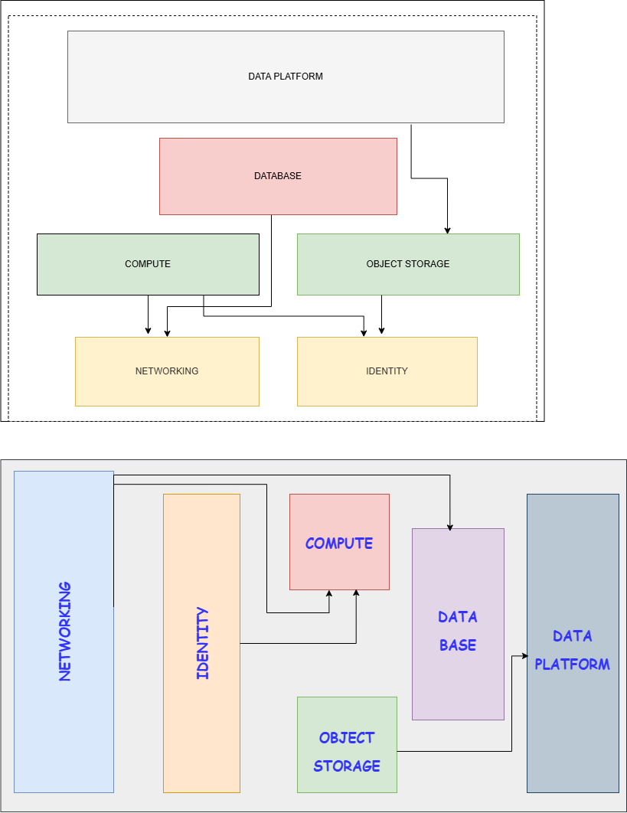

# COB Internal Infrastructure Provisioning Platform

## What is COB?

COB is Beejan Technologies' internal Terraform platform for provisioning
standardized AWS infrastructure. It provides a set of reusable,
versioned Terraform modules that engineering teams consume to provision
compliant, secure-by-default infrastructure without needing to design
networking, IAM, storage, compute, or database configurations from
scratch for every project.

COB is built and maintained by the Platform Engineering team.

## The Problem COB Solves

As Beejan Technologies grew, infrastructure provisioning became a
bottleneck: every team's request went through Platform Engineering
manually, and different teams ended up with inconsistent, sometimes
insecure configurations like inconsistent S3 versioning, inconsistent IAM
policies, inconsistent tagging, and no clear ownership of network
design decisions.

COB replaces "ask Platform Engineering to build it for you" with "use
the platform's standard modules yourself"; while keeping Platform
Engineering in control of the underlying security and architectural
standards.

## Repository Structure

```text
cob-platform/
├── modules/
│ ├── networking/
│ ├── identity/
│ ├── storage/
│ ├── compute-ec2/
│ ├── compute-ecs/
│ ├── database/
│ └── data-platform/
├── environments/ # Platform Engineering's own infrastructure 
├── examples/ # Runnable, illustrative usage of the modules
├── docs/ # Architecture, design reasoning, security standards
```

### BREAKDOWN

- **`modules/`** is the product each subfolder is an independently
  versioned, reusable capability. This is what other teams consume.

- **`environments/`** contains only infrastructure that Platform
  Engineering itself operates (e.g., shared platform resources). It
  does not contain other teams' deployed infrastructure each
  consuming team maintains their own environment configuration in
  their own repository, referencing COB modules by version.

- **`examples/`** contains standalone, runnable demonstrations of how
  to consume COB's modules, using minimal/illustrative values. These
  are for learning, not production use.

## Available Capabilities

| Module | Purpose |
| -------- | --------- |
| `networking` | VPC, subnets, routing, NAT gateways, and baseline network security posture. |
| `identity` | Reusable IAM role/policy patterns with least-privilege guardrails. |
| `storage` | Standardized, secure-by-default S3 object storage (encryption, versioning, lifecycle). |
| `compute-ec2` | Autoscaling EC2 workloads with composed networking and IAM. |
| `compute-ecs` | ECS services with composed networking and IAM. |
| `database` | Managed RDS databases with secure networking and backup defaults. |
| `data-platform` | Glue Data Catalog and Athena integration for analytics over S3 data. |

See each module's own `README.md` for detailed inputs, outputs, and
design reasoning.

## Architecture



## How to Consume COB

COB modules are consumed by referencing them from your own team's
Terraform configuration, pinned to a specific released version never
an unpinned branch.

Your own team's repository should maintain its own `environments/dev`
and `environments/prod` directories, each with their own Terraform
state. COB provides the reusable modules, not your team's deployed
infrastructure.

See [`docs/onboarding.md`](docs/onboarding.md) for a
full walkthrough.

## Supported Environments

COB modules are designed to be called independently per environment,
with no shared resources between calls. At minimum, COB supports:

- `dev`
- `prod`

Each environment should have its own Terraform state, provisioned by
calling the same module(s) with environment-specific input values.

## Engineering Standards Enforced by COB

Rather than relying on every team remembering security best practices,
COB bakes the following into its modules by default:

- Encryption at rest (S3, RDS)
- Least-privilege IAM patterns with permission boundaries
- Secure-by-default S3 configuration (public access blocked, TLS enforced)
- Network isolation between public and private tiers
- Consistent resource tagging and naming conventions
- Environment separation (no shared state or resources across environments)

## Documentation Index

- [`docs/module-boundaries.md`](docs/module-boundaries.md) — why modules are scoped the way they are (encapsulation, privilege, volatility reasoning)
- [`docs/onboarding.md`](docs/onboarding.md) — how a new team starts consuming COB

## Known Limitations

- No support for multi-region deployments in this version.
- No VPC peering or Transit Gateway support yet.

## Ownership

Maintained by the Platform Engineering team at Beejan Technologies.
Contact Platform Engineering directly.
